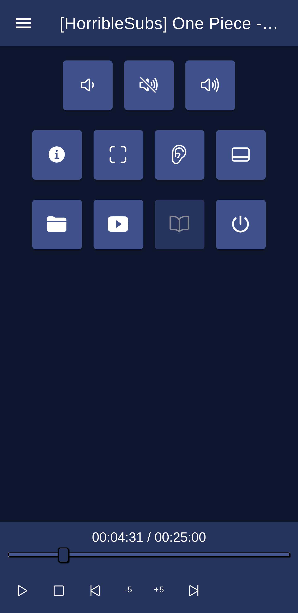
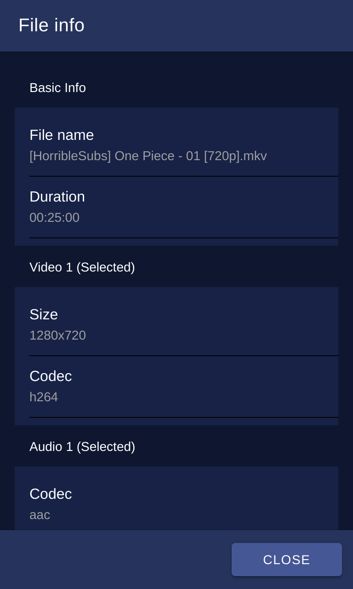
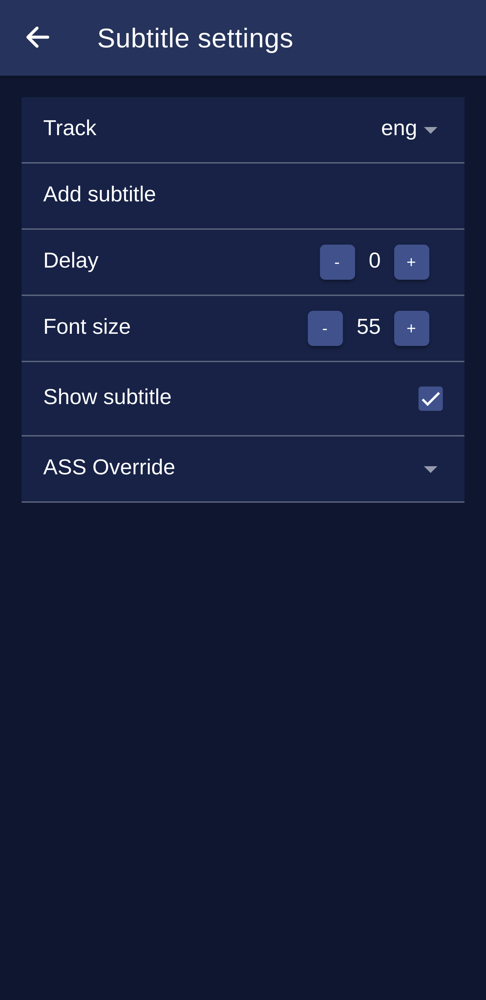
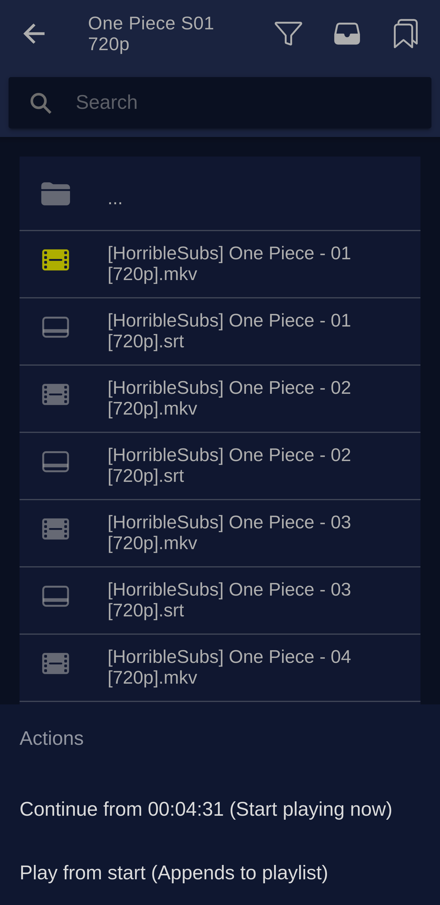
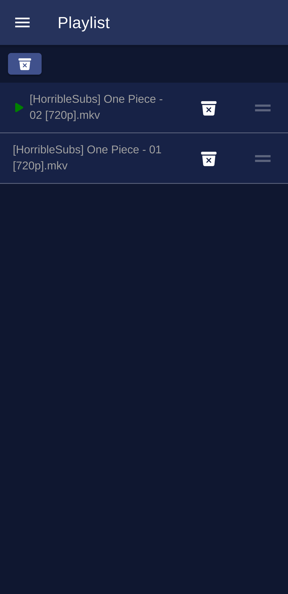
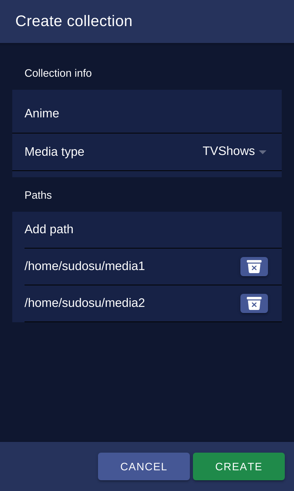

## MPV-Remote Android app

MPV Remote application for controlling your media player

## Why am I doing this?

I don't have too much experince with Ionic VUE, Node.JS developmment and want improve.

Kodi not renders properly some ASS/SSA subtitles some anime have overanimated subtitles. Kodi not likes it much. MPV plays everything fine, but did not find a proper featureful remote app.

## Functions

- Basic media controls,
- Open Youtube videos (youtube-dl required),
- Open files from your host computer, network storage also supported,
- Audio & Subtitle track selector,
- Playlist handling,
- Media file info,
- Media collection handling,
- Media status time can be stored on host machine. You can continue playback where you left off,
- Open videos from Youtube app by using share function,
- Open online streams from other apps for example [Aniyomi anime streamer](https://github.com/jmir1/aniyomi)

## How to use it

First you need the plugin and server for MPV. [Follow instructions here.](https://github.com/husudosu/mpv-remote-node)

After plugin installed, you can install the Android application which can be found in this repo.

[Latest release](https://github.com/husudosu/mpv-remote-app/releases/latest)

Configure IP & Port in your application and run mpv with --idle flag on your host PC.

The app not available on Google Play yet. I want improve my application before putting it to wider public.

## App available on IzzyOnDroid

    

## Screnshoots (2021-08-07) state

|                          Player                          |                           Media info                           |
| :------------------------------------------------------: | :------------------------------------------------------------: |
|  |  |

|                        Subtitle panel                        |     Filebrowser at collection presenting media continue screen     |
| :----------------------------------------------------------: | :----------------------------------------------------------------: |
|  |  |

|                           Playlist                           |                         Collection creating                          |
| :----------------------------------------------------------: | :------------------------------------------------------------------: |
|  |  |
