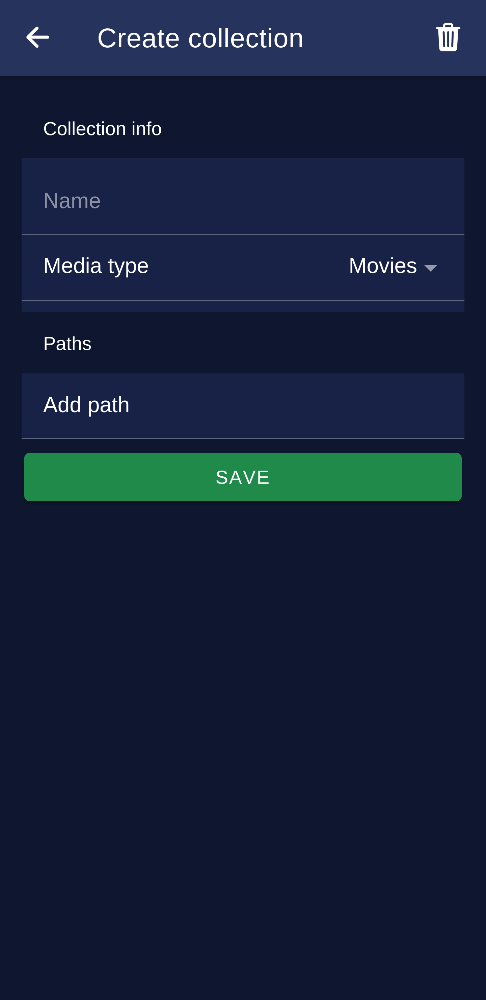

## MPV-Remote Android app

MPV Remote application for controlling your media player

NOTE:
This project under heavy development right now. Some things can break. I use this app for my media center setup.

## Why am I doing this?

I don't have too much experince with Ionic VUE, Node.JS developmment and want improve.

Kodi not renders properly some ASS/SSA subtitles some anime have overanimated subtitles. Kodi not likes it much. MPV plays everything fine, but did not find a proper featureful remote app.

## Functions

- Basic media controls,
- Open Youtube videos (youtube-dl required),
- Open files from your host computer, network storage also supported,
- Audio & Subtitle track selector,
- Playlist handling,
- Media file info,
- Media collection handling,
- Media status time stored on host machine. You can continue playback where you left off

## How to use it

First you need the plugin and server for MPV. [Follow instructions here.](https://github.com/husudosu/mpv-remote-node)

After plugin installed, you can install the Android application which can be found in this repo.

android/app/release/app-release.apk

Configure IP & Port in your application and run mpv with --idle flag on your host PC.

The app not available on Google Play yet. I want improve my application before putting it to wider public.

## About project state

There are several things missing like Socket.IO & Express API error message rendering on Android app and connection loss not always handled for example on Filebrowser, media collection handling.

For more missing stuff check TODO here and at plugin repo TODO.

## Screnshoots (2021-08-07) state

|                          Player                          |                           Media info                           |
| :------------------------------------------------------: | :------------------------------------------------------------: |
|  |  |

|                        Subtitle panel                        |     Filebrowser at collection presenting media continue screen     |
| :----------------------------------------------------------: | :----------------------------------------------------------------: |
|  |  |

|                           Playlist                           |                         Collection creating                          |
| :----------------------------------------------------------: | :------------------------------------------------------------------: |
|  |  |
