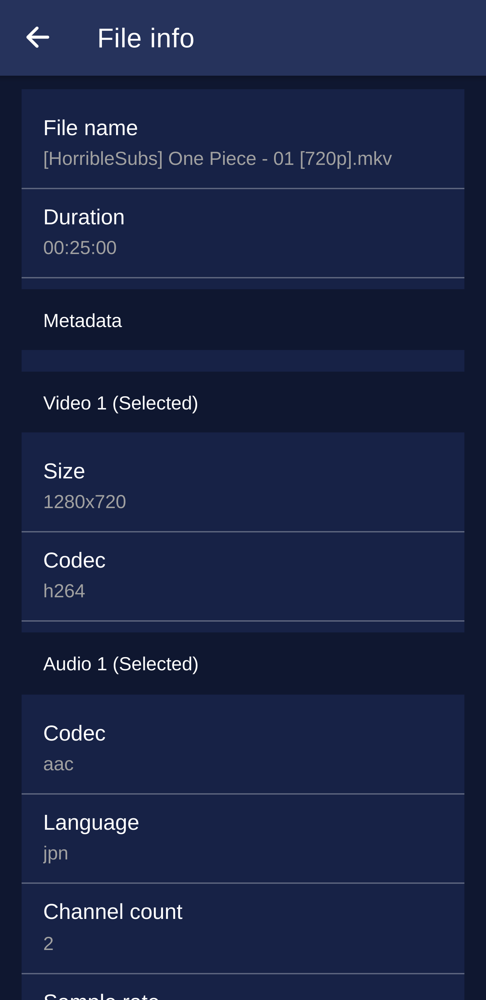

# MPV-Remote Android app

<p align="center">

</p>

MPV Remote is a mobile application for controlling MPV media player remotely running on your PC.

# Features

- Basic media controls,
- Open files from your host computer, network storage also supported,
- Audio & Subtitle track selector,
- Playlist handling,
- Media file info,
- Media collection handling,
- Media status time can be stored on host machine. You can continue playback where you left off,
- Open videos from Youtube app by using share function,
- Open online streams from other apps.

# How to use it

First you need the plugin and server for MPV. [Follow instructions here.](https://github.com/husudosu/mpv-remote-node)

After plugin installed, you can install the Android application which can be found in this repo.

[Latest release](https://github.com/husudosu/mpv-remote-app/releases/latest)

Configure IP & Port in your application and run mpv with --idle flag on your host PC.

The app not available on Google Play yet. I want improve my application before putting it to wider public.

# Troubleshooting

## When I start the app only a blank screen appears

You can fix this by deleting all data for app. **Reinstalling the app is not enough,** you have to delete all stored data related to the app.
Sometimes I get this after update on my Phone Xiaomi Redmi Note 10 Pro with Android 12.0

Debug message (Release):

```
open libmigui.so failed! dlopen - dlopen failed: library "libmigui.so" not found
```

[Probably a Miui related error](https://github.com/evilrat/flutter_zoom_sdk/issues/65)

# Note for older Android users

**Minimum Android version required:** 7.0 (API level 24)
On most Android versions the app works fine, with some exceptions:

## Android 7.0 (tested on Android emulator)

The app functionality works fine.

Some issues with the looks:

- CSS not working on the side menu,
- When you pause and return to the app Media title not appearing.

Report if you have any other issue.

# Experimental features

- Android notification by using `cordova-plugin-music-controls2` (disabled by default, it has issues) check out [TODO file](https://github.com/husudosu/mpv-remote-app/blob/master/TODO.md)

# App available on IzzyOnDroid

<p align="center">
    <a href="https://apt.izzysoft.de/fdroid/index/apk/com.husudosu.mpvremote">
    
    </a>
</p>

# Screnshoots taken from 1.0.7

|                          Player                          |                           Media info                           |
| :------------------------------------------------------: | :------------------------------------------------------------: |
|  |  |

|                        Subtitle panel                        |            Filebrowser presenting media continue screen            |
| :----------------------------------------------------------: | :----------------------------------------------------------------: |
|  |  |

|                           Playlist                           |                         Collection creating                          |
| :----------------------------------------------------------: | :------------------------------------------------------------------: |
|  |  |

# Disclaimer

The app developer DOES NOT promotes piracy! Other apps and modules used by this app may include some level of piracy.
